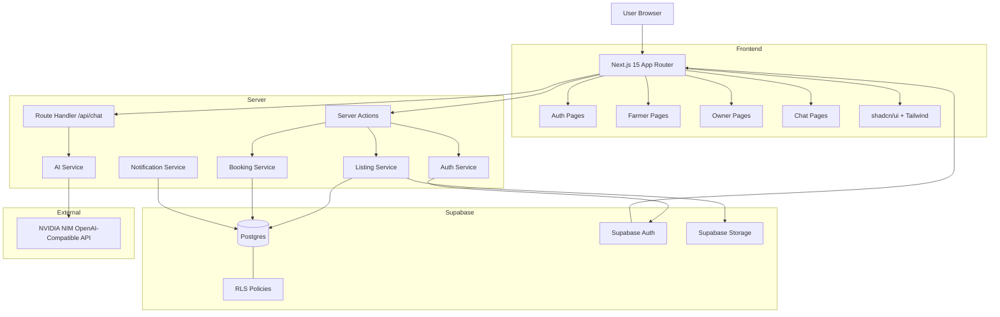
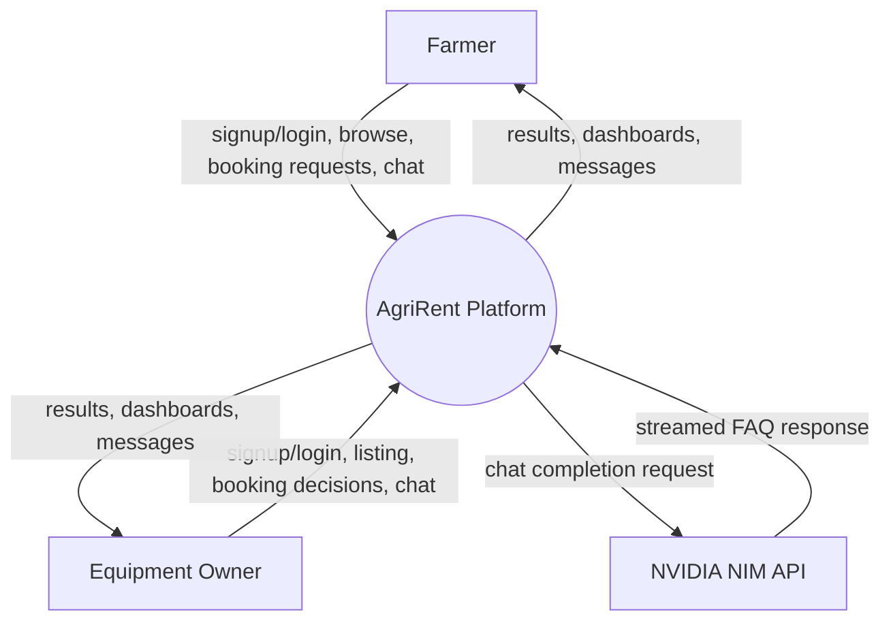
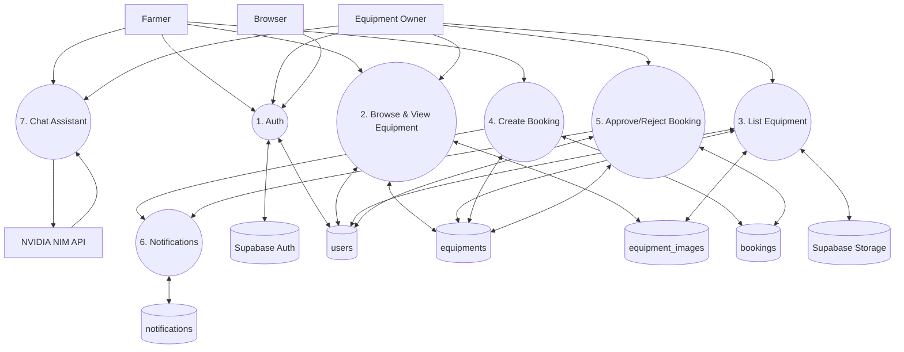
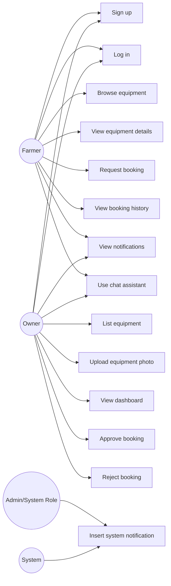
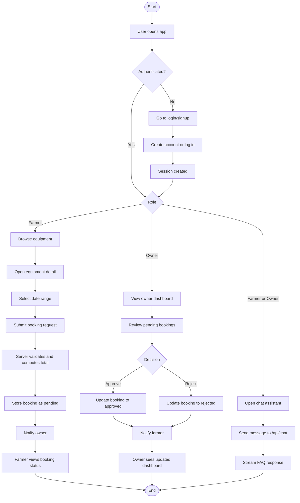
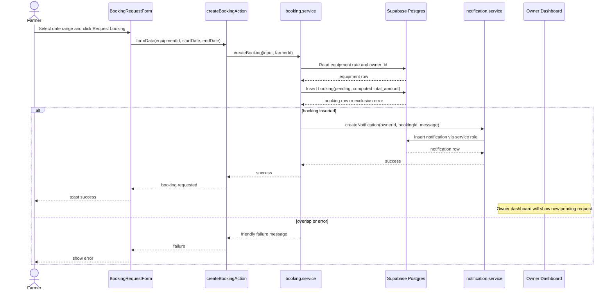

CHAPTER 3
SYSTEM DESIGN

3.1 System Architecture

AgriRent follows a layered web application architecture built around the Next.js App Router, Supabase services, and a clear separation between presentation, server logic, and data storage. The browser interacts with role-based pages rendered by Next.js, while Server Actions and service functions manage business operations such as authentication, equipment creation, booking requests, booking approval, and notifications. Supabase provides the database, authentication, and storage layers, and the chat assistant is exposed through a dedicated API route that connects to an OpenAI-compatible NVIDIA NIM endpoint.

The architecture is intentionally designed to keep sensitive operations on the server side. The browser never communicates directly with the database using privileged credentials. Instead, the application uses three Supabase client paths: a browser client for user-facing interactions, a server client for authenticated server-side queries, and a service-role admin client for narrow system-generated writes such as notifications. This structure supports the project’s security goals and makes the booking workflow more reliable.

Figure 3.1 shows the overall system architecture of AgriRent. The figure illustrates how the user browser interacts with the Next.js application, how server actions delegate to specialized services, and how Supabase supplies authentication, storage, and PostgreSQL persistence. It also shows the dedicated AI route and the external NVIDIA NIM service used for FAQ chat completion.

3.2 DFD Level 0

The Level 0 data flow diagram represents AgriRent as a single high-level process that receives requests from the main actors and returns corresponding results. At this level, the system is viewed as one integrated platform that manages authentication, listings, bookings, notifications, and chat responses.

Figure 3.2 presents the DFD Level 0 view. The diagram shows two external actors, farmer and equipment owner, exchanging data with the AgriRent platform. Farmers submit signup, login, browsing, booking, and chat requests, while owners submit listing and booking decision requests. The system then returns dashboards, confirmation messages, and streamed chat responses. The figure emphasizes that all internal processing is encapsulated inside a single platform boundary.

3.3 DFD Level 1

The Level 1 data flow diagram expands the system into its major sub-processes and shows how each process interacts with the underlying data stores. This level provides a clearer picture of the internal implementation without descending into component-level detail.

Figure 3.3 shows the Level 1 DFD. The diagram decomposes the platform into authentication, equipment browsing, equipment listing, booking creation, booking decision handling, notifications, and chat assistance. It also shows the main data stores used by each process: `users`, `equipments`, `equipment_images`, `bookings`, `notifications`, Supabase Auth, and Supabase Storage. This figure explains how each functional area is connected to the database and how the application maintains separation between user-facing operations and persistence.

3.4 Use Case Diagram

The use case view of AgriRent identifies the primary interactions available to the two user roles and the system-level notification behavior used internally. It helps to clarify what each actor can do within the implemented scope of the project.

Figure 3.4 presents the use case diagram. The figure shows that the farmer role is centered on discovery and booking, while the owner role is centered on listing management and booking decisions. Both roles can authenticate and use the chat assistant. The diagram also shows the internal notification insertion use case, which is performed by the system through a server-only path rather than by an end user directly.

3.5 Activity Diagram

The activity flow of AgriRent describes the operational sequence from user entry to role-specific actions. It shows how the application branches based on authentication status and user role.

Figure 3.5 illustrates the activity diagram for the application. The figure shows the complete behavior of the system from login to role-based execution paths. For farmers, the flow ends with booking request submission and status viewing. For owners, the flow ends with booking review and decision-making. The chat assistant branch is shown separately because it is available to both roles and does not alter database state.

3.6 Sequence Diagram

The sequence diagram focuses on one of the most important implemented flows: a farmer requesting a booking for an equipment item. This sequence shows the order of interaction between the user interface, server action, booking service, database, and notification service.

Figure 3.6 shows the sequence for booking creation. The diagram demonstrates that the server first loads the equipment data, computes the booking amount, and then attempts the insert. If the insert succeeds, the system creates a notification for the owner. If the booking conflicts with an existing active reservation, the user receives a friendly failure message instead of a raw database error. The figure highlights the role of the service layer in protecting the booking workflow.

3.7 Module Interaction

The modules in AgriRent are organized so that the user interface, business logic, validation, and data access remain separated. This structure makes the application easier to understand and reduces coupling between the parts of the system.

- Authentication module
  - Handles signup, login, logout, session refresh, and role-based redirects.
  - Interacts with Supabase Auth and the `users` table.
- Equipment module
  - Handles equipment creation, equipment browsing, and equipment detail display.
  - Interacts with `equipments`, `equipment_images`, and Supabase Storage.
- Booking module
  - Handles booking request creation, approval, and rejection.
  - Interacts with `bookings` and uses server-side price calculation.
- Notification module
  - Creates and reads booking notifications.
  - Uses a service-role client for inserts and a normal server client for reads.
- Chat module
  - Handles user chat input and streaming AI responses.
  - Interacts with the `/api/chat` route and the NVIDIA NIM API.
- Validation module
  - Uses Zod schemas for auth, equipment, and booking input validation.
  - Prevents invalid or tampered payloads from reaching the business logic layer.
- Presentation module
  - Contains pages, layouts, forms, cards, calendars, and buttons used in the UI.
  - Provides the interactive interface for farmers and owners.

The module interaction pattern is primarily top-down. User actions start in the presentation layer, pass through a server action when mutation is required, then reach a service function that performs the business logic, and finally interact with the database or external API. This design ensures that the application remains maintainable and that critical rules such as owner-only listing creation, pending-only booking updates, and server-side total calculation remain enforced consistently across the system.

