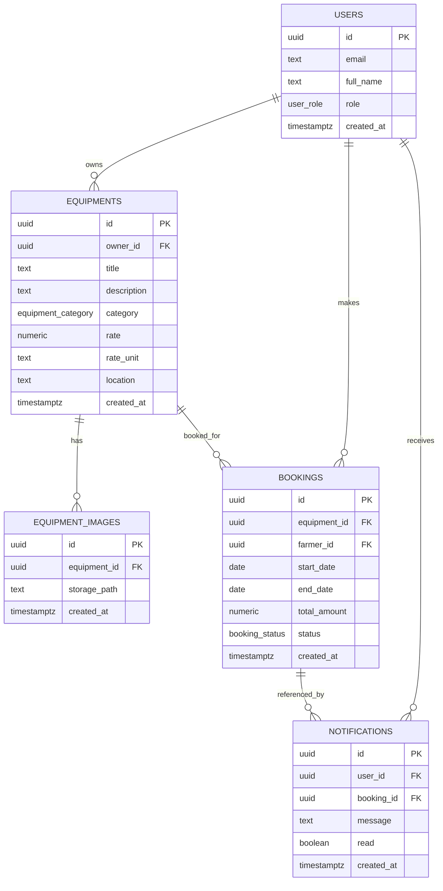

CHAPTER 5
DATABASE DESIGN

5.1 Database Design

The database design of AgriRent follows a relational model centered on users, equipment listings, equipment images, bookings, and notifications. The schema is implemented in Supabase PostgreSQL and is designed to support the complete marketplace workflow of the application. Each table represents one functional area of the system, while foreign keys and row-level security policies enforce consistency and access control.

The database is structured so that identity data is separated from marketplace data. User accounts are stored in the `users` table, while equipment listings are stored in `equipments`. Each equipment record belongs to one owner, each image belongs to one equipment record, each booking belongs to one farmer and one equipment item, and each notification belongs to one user. This structure keeps the model normalized and makes the relationships between entities explicit.



Figure 5.1 shows the entity-relationship diagram of AgriRent. The diagram illustrates the core database entities and the way they are connected through one-to-many relationships. The `users` table acts as the central identity entity, while the other tables represent marketplace activity, stored media, and user notifications.

5.2 Relationships

The relationships in the AgriRent database are defined through foreign keys and supported by application-level service logic and RLS policies.

- A user can own many equipment listings.
  - `equipments.owner_id` references `users.id`.
- A user can create many bookings.
  - `bookings.farmer_id` references `users.id`.
- A user can receive many notifications.
  - `notifications.user_id` references `users.id`.
- An equipment listing can have many images.
  - `equipment_images.equipment_id` references `equipments.id`.
- An equipment listing can have many bookings over time.
  - `bookings.equipment_id` references `equipments.id`.
- A booking can be referenced by notifications.
  - `notifications.booking_id` references `bookings.id`.

In addition to the explicit foreign-key structure, the database uses a booking exclusion constraint to prevent overlapping active bookings for the same equipment. This is a critical integrity rule because it prevents double-booking at the database level rather than relying only on application checks. The constraint applies to `pending` and `approved` bookings.

The database also uses helper functions such as `current_user_role()`, `is_owner()`, and `owns_equipment()` to support row-level security without recursive cross-table checks. This approach allows the schema to remain secure while still letting the application determine ownership and authorization correctly.

5.3 Primary Keys and Foreign Keys

The primary keys and foreign keys define the identity and linking structure of the database. All key fields use UUID values, which is appropriate for a distributed web application backed by Supabase.

Primary Keys:

- `users.id`
- `equipments.id`
- `equipment_images.id`
- `bookings.id`
- `notifications.id`

Foreign Keys:

- `equipments.owner_id` references `users.id`
- `equipment_images.equipment_id` references `equipments.id`
- `bookings.equipment_id` references `equipments.id`
- `bookings.farmer_id` references `users.id`
- `notifications.user_id` references `users.id`
- `notifications.booking_id` references `bookings.id`

These keys ensure referential integrity across the system. For example, a booking cannot exist without a valid equipment item and a valid farmer account, and a notification cannot reference a non-existent booking. The use of UUID keys also keeps the schema aligned with modern Supabase practices and avoids sequential identifier exposure.

5.4 Table Descriptions

Table: `users`

| Column | Data Type | Constraints | Description |
|--------|-----------|-------------|-------------|
| `id` | `uuid` | Primary Key, references `auth.users(id)` | Unique identifier for the user account. |
| `email` | `text` | Not Null | Email address of the user. |
| `full_name` | `text` | Nullable | Full name entered during signup. |
| `role` | `user_role` | Not Null | Account role: `farmer` or `owner`. |
| `created_at` | `timestamptz` | Not Null, default `now()` | Timestamp when the profile row was created. |

Table: `equipments`

| Column | Data Type | Constraints | Description |
|--------|-----------|-------------|-------------|
| `id` | `uuid` | Primary Key, default `gen_random_uuid()` | Unique identifier for the equipment listing. |
| `owner_id` | `uuid` | Not Null, foreign key to `users.id` | Owner of the equipment listing. |
| `title` | `text` | Not Null | Equipment title shown in browse and detail views. |
| `description` | `text` | Nullable | Detailed description of the equipment. |
| `category` | `equipment_category` | Not Null | Equipment category such as Tractor or Harvester. |
| `rate` | `numeric(10,2)` | Not Null | Rental rate stored by the owner. |
| `rate_unit` | `text` | Not Null, default `day` | Rate basis used by the booking calculation. |
| `location` | `text` | Nullable | Optional location string for the listing. |
| `created_at` | `timestamptz` | Not Null, default `now()` | Timestamp of listing creation. |

Table: `equipment_images`

| Column | Data Type | Constraints | Description |
|--------|-----------|-------------|-------------|
| `id` | `uuid` | Primary Key, default `gen_random_uuid()` | Unique identifier for the image row. |
| `equipment_id` | `uuid` | Not Null, foreign key to `equipments.id` | Equipment item to which the image belongs. |
| `storage_path` | `text` | Not Null | Storage path of the uploaded file in Supabase Storage. |
| `created_at` | `timestamptz` | Not Null, default `now()` | Timestamp of image record creation. |

Table: `bookings`

| Column | Data Type | Constraints | Description |
|--------|-----------|-------------|-------------|
| `id` | `uuid` | Primary Key, default `gen_random_uuid()` | Unique identifier for the booking request. |
| `equipment_id` | `uuid` | Not Null, foreign key to `equipments.id` | Equipment being booked. |
| `farmer_id` | `uuid` | Not Null, foreign key to `users.id` | Farmer who created the booking. |
| `start_date` | `date` | Not Null | Start date of the booking range. |
| `end_date` | `date` | Not Null | End date of the booking range. |
| `total_amount` | `numeric(10,2)` | Not Null | Server-calculated total booking amount. |
| `status` | `booking_status` | Not Null, default `pending` | Booking state. |
| `created_at` | `timestamptz` | Not Null, default `now()` | Timestamp of booking creation. |

Table: `notifications`

| Column | Data Type | Constraints | Description |
|--------|-----------|-------------|-------------|
| `id` | `uuid` | Primary Key, default `gen_random_uuid()` | Unique identifier for the notification. |
| `user_id` | `uuid` | Not Null, foreign key to `users.id` | Notification recipient. |
| `booking_id` | `uuid` | Nullable, foreign key to `bookings.id` | Related booking if the notification is booking-related. |
| `message` | `text` | Not Null | Notification text shown in the dashboard. |
| `read` | `boolean` | Not Null, default `false` | Read/unread state. |
| `created_at` | `timestamptz` | Not Null, default `now()` | Timestamp of notification creation. |

5.5 SQL Schema

The SQL schema used by AgriRent is defined in the Supabase migration files. The following schema summary reflects the implemented database structure.

```sql
CREATE EXTENSION IF NOT EXISTS btree_gist;

CREATE TYPE user_role AS ENUM ('farmer', 'owner');
CREATE TYPE equipment_category AS ENUM ('Tractor', 'Harvester', 'Plough', 'Rotavator', 'Sprayer', 'Other');
CREATE TYPE booking_status AS ENUM ('pending', 'approved', 'rejected', 'completed', 'cancelled');

CREATE TABLE public.users (
  id uuid PRIMARY KEY REFERENCES auth.users(id) ON DELETE CASCADE,
  email text NOT NULL,
  full_name text,
  role user_role NOT NULL,
  created_at timestamptz NOT NULL DEFAULT now()
);

CREATE TABLE public.equipments (
  id uuid PRIMARY KEY DEFAULT gen_random_uuid(),
  owner_id uuid NOT NULL REFERENCES public.users(id),
  title text NOT NULL,
  description text,
  category equipment_category NOT NULL,
  rate numeric(10,2) NOT NULL,
  rate_unit text NOT NULL DEFAULT 'day',
  location text,
  created_at timestamptz NOT NULL DEFAULT now()
);

CREATE TABLE public.equipment_images (
  id uuid PRIMARY KEY DEFAULT gen_random_uuid(),
  equipment_id uuid NOT NULL REFERENCES public.equipments(id) ON DELETE CASCADE,
  storage_path text NOT NULL,
  created_at timestamptz NOT NULL DEFAULT now()
);

CREATE TABLE public.bookings (
  id uuid PRIMARY KEY DEFAULT gen_random_uuid(),
  equipment_id uuid NOT NULL REFERENCES public.equipments(id),
  farmer_id uuid NOT NULL REFERENCES public.users(id),
  start_date date NOT NULL,
  end_date date NOT NULL,
  total_amount numeric(10,2) NOT NULL,
  status booking_status NOT NULL DEFAULT 'pending',
  created_at timestamptz NOT NULL DEFAULT now()
);

ALTER TABLE public.bookings ADD CONSTRAINT bookings_no_overlap
  EXCLUDE USING gist (
    equipment_id WITH =,
    daterange(start_date, end_date, '[]') WITH &&
  ) WHERE (status IN ('pending', 'approved'));

CREATE TABLE public.notifications (
  id uuid PRIMARY KEY DEFAULT gen_random_uuid(),
  user_id uuid NOT NULL REFERENCES public.users(id),
  booking_id uuid REFERENCES public.bookings(id),
  message text NOT NULL,
  read boolean NOT NULL DEFAULT false,
  created_at timestamptz NOT NULL DEFAULT now()
);
```

The schema is accompanied by row-level security policies and helper functions. These policies ensure that users can only access their own profile data, farmers can access their own bookings, owners can access the bookings associated with their equipment, and only the system can perform the narrow notification insert workflow used by the application.

The database design supports the current implementation cleanly and does not introduce any tables beyond those that already exist in the project.

